## 동시성 - select 후 없을 때 insert (삽입경쟁)


#### 문제상황
* 해당 name을 갖는 row의 count를 증가시키려 한다. 
* 이 때, 해당 name을 갖는 row가 없을 때(find) save를 하려고 하는데, 동시적으로 진행시 여러개의 동일 row가 생성된다
* 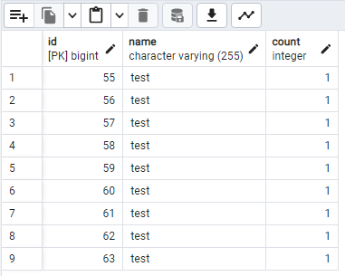
* 소스
    ```java
    @Transactional(propagation = Propagation.REQUIRES_NEW)
    public void check(StatisticsDto statisticsDto) {
        // ...
    }
    //===========================================================
    public interface StatisticsRepository extends JpaRepository<Statistics, Long> {
        Optional<Statistics> findByName(String name);
    }
    ```
  
#### CASE
1. ```@Transactional(isolation = Isolation.SERIALIZABLE, propagation = Propagation.REQUIRES_NEW)```
    * 1개 row + Exception<br>
   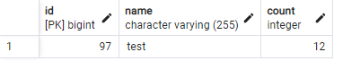
   ```
    2025-07-11T14:51:10.939+09:00  WARN 21824 --- [pool-2-thread-5] o.h.engine.jdbc.spi.SqlExceptionHelper   : SQL Error: 0, SQLState: 40001
    2025-07-11T14:51:10.939+09:00 ERROR 21824 --- [pool-2-thread-5] o.h.engine.jdbc.spi.SqlExceptionHelper   : 오류: 동시 업데이트 때문에 순차적 액세스가 불가능합니다
   ```
2. ```@Transactional(isolation = Isolation.REPEATABLE_READ, propagation = Propagation.REQUIRES_NEW)```
   * 9개 row<br>
   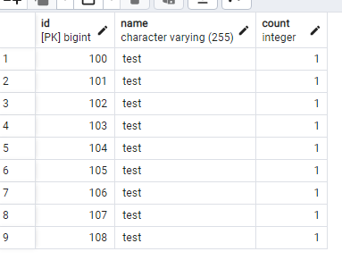
   ```
   RuntimeException - Query did not return a unique result: 9 results were returned
   ```
3. ```@Transactional(isolation = Isolation.READ_COMMITTED, propagation = Propagation.REQUIRES_NEW)```
  * 9개 row<br>
    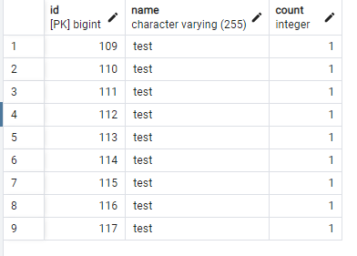
   ```
   RuntimeException - Query did not return a unique result: 9 results were returned
   ```

---

4. ```@Transactional(isolation = Isolation.SERIALIZABLE, propagation = Propagation.REQUIRES_NEW)``` + ```@Lock(LockModeType.PESSIMISTIC_WRITE)```
  * 1개 row + Exception<br>
    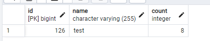
   ```
   2025-07-11T14:59:11.424+09:00  WARN 3800 --- [ool-2-thread-10] o.h.engine.jdbc.spi.SqlExceptionHelper   : SQL Error: 0, SQLState: 40001
   2025-07-11T14:59:11.424+09:00 ERROR 3800 --- [ool-2-thread-10] o.h.engine.jdbc.spi.SqlExceptionHelper   : 오류: 동시 업데이트 때문에 순차적 액세스가 불가능합니다
   2025-07-11T14:59:11.424+09:00 ERROR 3800 --- [ool-2-thread-10] c.e.c.service.StatisticsService          : RuntimeException - JDBC exception executing SQL [select s1_0.id,s1_0.count,s1_0.name from statistics s1_0 where s1_0.name=? for no key update] [오류: 동시 업데이트 때문에 순차적 액세스가 불가능합니다] [n/a]; SQL [n/a]
   2025-07-11T14:59:11.425+09:00  INFO 3800 --- [ool-2-thread-10] c.e.c.service.StatisticsService          : @@ check end
   ```
5. ```@Transactional(isolation = Isolation.REPEATABLE_READ, propagation = Propagation.REQUIRES_NEW)``` + ```@Lock(LockModeType.PESSIMISTIC_WRITE)```
  * 9개 row<br>
  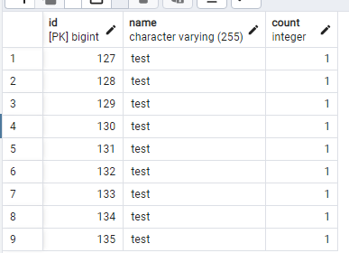
   ```
   2025-07-14T08:07:24.127+09:00 ERROR 20248 --- [ool-2-thread-10] c.e.c.service.StatisticsService          : RuntimeException - Query did not return a unique result: 9 results were returned
   ```
6. ```@Transactional(isolation = Isolation.READ_COMMITTED, propagation = Propagation.REQUIRES_NEW)``` + ```@Lock(LockModeType.PESSIMISTIC_WRITE)```
   * 9개 row<br>
  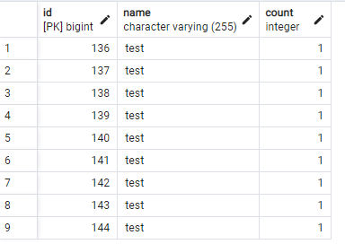
   ```
   2025-07-14T08:08:54.598+09:00 ERROR 12936 --- [pool-2-thread-2] c.e.c.service.StatisticsService          : RuntimeException - Query did not return a unique result: 9 results were returned
   ```

---

7. ```@Transactional(isolation = Isolation.SERIALIZABLE, propagation = Propagation.REQUIRES_NEW)``` + ```@Lock(LockModeType.PESSIMISTIC_READ)```
    * 1개 row + Exception<br>
   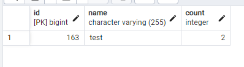
   ```
    2025-07-14T08:10:59.068+09:00  WARN 14680 --- [ool-2-thread-13] o.h.engine.jdbc.spi.SqlExceptionHelper   : SQL Error: 0, SQLState: 40P01
    2025-07-14T08:10:59.068+09:00 ERROR 14680 --- [ool-2-thread-13] o.h.engine.jdbc.spi.SqlExceptionHelper   : 오류: deadlock 발생했음
        Detail: 21932 프로세스가 ShareLock 상태로 지연되고 있음(해당 작업: 트랜잭션 4121); 1488 프로세스에 의해 블록킹되었음
        1488 프로세스가 ShareLock 상태로 지연되고 있음(해당 작업: 트랜잭션 4119); 21932 프로세스에 의해 블록킹되었음
        Hint: 쿼리 상세 정보는 서버 로그를 참조하십시오.
        Where: 0,13 튜플(해당 릴레이션 "statistics")을 갱신하는 중에 발생
    2025-07-14T08:11:00.077+09:00  WARN 14680 --- [ool-2-thread-12] o.h.engine.jdbc.spi.SqlExceptionHelper   : SQL Error: 0, SQLState: 40P01
    2025-07-14T08:11:00.077+09:00 ERROR 14680 --- [ool-2-thread-12] o.h.engine.jdbc.spi.SqlExceptionHelper   : 오류: deadlock 발생했음
        Detail: 7188 프로세스가 ShareLock 상태로 지연되고 있음(해당 작업: 트랜잭션 4121); 1488 프로세스에 의해 블록킹되었음
        1488 프로세스가 ShareLock 상태로 지연되고 있음(해당 작업: 트랜잭션 4122); 7188 프로세스에 의해 블록킹되었음
        Hint: 쿼리 상세 정보는 서버 로그를 참조하십시오.
        Where: 0,13 튜플(해당 릴레이션 "statistics")을 갱신하는 중에 발생
   ```

8. ```@Transactional(isolation = Isolation.REPEATABLE_READ, propagation = Propagation.REQUIRES_NEW)``` + ```@Lock(LockModeType.PESSIMISTIC_READ)```
    * 9개 row<br>
   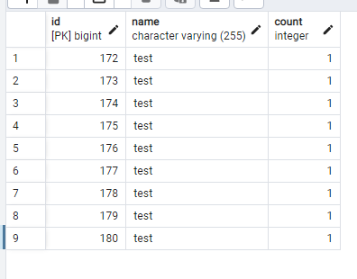
   ```
   2025-07-14T08:13:30.036+09:00 ERROR 13896 --- [pool-2-thread-1] c.e.c.service.StatisticsService          : RuntimeException - Query did not return a unique result: 9 results were returned
   ```

9. ```@Transactional(isolation = Isolation.READ_COMMITTED, propagation = Propagation.REQUIRES_NEW)``` + ```@Lock(LockModeType.PESSIMISTIC_READ)```
    * 9개 row<br>
   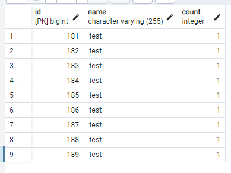
   ```
   2025-07-14T08:15:05.233+09:00 ERROR 14688 --- [ool-2-thread-17] c.e.c.service.StatisticsService          : RuntimeException - Query did not return a unique result: 9 results were returned
   ```

---

10. save단 분리 + ```@Transactional(isolation = Isolation.SERIALIZABLE)``` + ```@Lock(LockModeType.PESSIMISTIC_WRITE)```
    * 22개 row + Exception<br>
   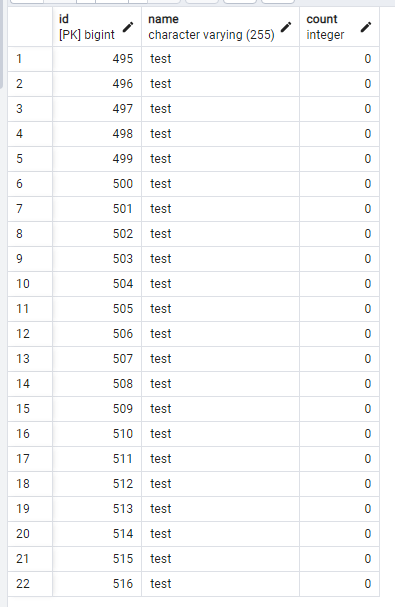
   ```
    RuntimeException - Query did not return a unique result: 12 results were returned
   ```
11. save단 분리 + ```@Transactional(isolation = Isolation.REPEATABLE_READ)``` + ```@Lock(LockModeType.PESSIMISTIC_WRITE)```
    * 22개 row + Exception<br>
   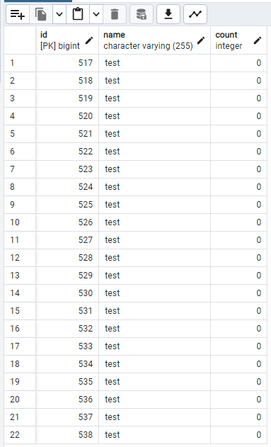
   ```
    RuntimeException - Query did not return a unique result: 12 results were returned
   ```

12. save단 분리 + ```@Transactional(isolation = Isolation.READ_COMMITTED)``` + ```@Lock(LockModeType.PESSIMISTIC_WRITE)```
    * 22개 row + Exception<br>
      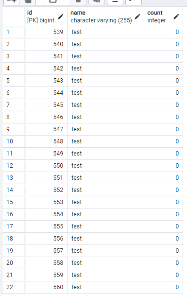
   ```
    RuntimeException - Query did not return a unique result: 12 results were returned
   ```

### 해결방법
1. @Transactional() 제거 + @Lock() 제거 + synchronized 사용
   * 단일 서버에서는 동시성 테스트가 성공, but 다중 서버일 경우 x
   * **synchronized가 동시성을 보장**하지만 **@Transactional은 AOP 기능을 활용하는 것**이라 __프록시 객체에 synchronized 키워드가 없어서 동시성 제어가 되지 않음.__
   * 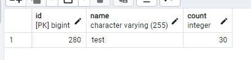
    ```
    public synchronized void checkWithSynchronized(StatisticsDto statisticsDto) {
        try {
            Statistics statistics = statisticsRepository.findByName(statisticsDto.getName()).orElseGet(() ->
                    statisticsInnerService.saveStatistics(statisticsDto.getName())
            );
            log.info("@@ check - statistics.getId : {}", statistics.getId());
            statistics.increaseCount(statisticsDto.getCount());
            statisticsRepository.save(statistics);
            log.info("@@ check - statistics.getCount : {}", statistics.getCount());
        } catch (LockAcquisitionException e) {
            log.error("LockAcquisitionException - {}", e.getMessage());
        } catch (RuntimeException e) {
            log.error("RuntimeException - {}", e.getMessage());
        } catch (Exception e) {
            log.error("Exception - {}", e.getMessage());
        }
        log.info("@@ check end");
    }
    ```

2. 일반 @Transactional(isolation = Isolation.READ_COMMITTED) + @Lock(LockModeType.PESSIMISTIC_WRITE) 사용
   * 비관적 락은 "**존재하는 row**"에만 락을 걸 수 있다. (row가 존재하지 않는 경우에는 아무런 락도 걸리지 않음)
   * 이때, 해당 key에 해당하는 row가 없다면 
   * → 락도 걸리지 않음 
   * → 동시에 여러 스레드가 save() 진행
   * → 결국 중복 insert
   * <자가 Service 분리 X 시>
     * 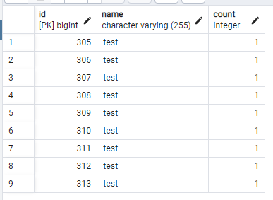
     * ```RuntimeException - Query did not return a unique result: 9 results were returned``` 발생
    ```java
    @Transactional(isolation = Isolation.READ_COMMITTED, propagation = Propagation.REQUIRES_NEW)
    public void checkWithReadCommitedAndWriteLock(StatisticsDto statisticsDto) {
        log.info("@@ check start");
        try {
            Statistics statistics = statisticsRepository.findByName(statisticsDto.getName()).orElseGet(() ->
                    saveStatistics(statisticsDto.getName())
            );
            log.info("@@ check - statistics.getId : {}", statistics.getId());
            statistics.increaseCount(statisticsDto.getCount());
            log.info("@@ check - statistics.getCount : {}", statistics.getCount());
        } catch (LockAcquisitionException e) {
            log.error("LockAcquisitionException - {}", e.getMessage());
        } catch (RuntimeException e) {
            log.error("RuntimeException - {}", e.getMessage());
        } catch (Exception e) {
            log.error("Exception - {}", e.getMessage());
        }
        log.info("@@ check end");
    }       
    ```
   * <자가 Service 분리 O 시>
     * 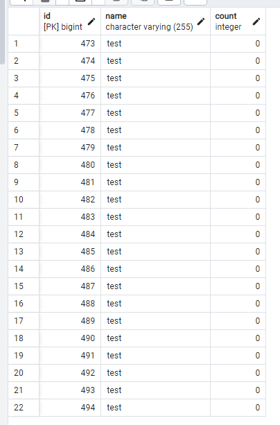
     * ```RuntimeException - Query did not return a unique result: 21 results were returned``` 발생
     ```java
     @Transactional(isolation = Isolation.READ_COMMITTED, propagation = Propagation.REQUIRES_NEW)
     public void checkWithReadCommitedAndWriteLock(StatisticsDto statisticsDto) {
         log.info("@@ check start");
         ...
             Statistics statistics = statisticsRepository.findByName(statisticsDto.getName()).orElseGet(() ->
                     statisticsInnerService.saveStatistics(statisticsDto.getName())
             );
    
         ...
         log.info("@@ check end");
     }
     ```

3. unique 키 사용 + @Transactional(isolation = Isolation.READ_COMMITTED) + @Lock(LockModeType.PESSIMISTIC_WRITE) + save를 REQUIRED_NEW로 진행 + 예외 캐치 후 재조회 + update문 직접 sql 사용
   * 성공
   * 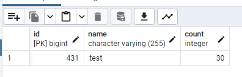
    ```java
    @Transactional(isolation = Isolation.READ_COMMITTED, propagation = Propagation.REQUIRES_NEW)
    public void check(StatisticsDto statisticsDto) {
        log.info("@@ check start");
        try {
            Statistics statistics = statisticsRepository.findByName(statisticsDto.getName()).orElseGet(() ->
                    {
                        try {
                            System.out.println(" == save ");
                            return statisticsInnerService.saveStatistics(statisticsDto.getName());
                        } catch (DataIntegrityViolationException e) {
                            System.out.println(" == 재조회 ");
                            return statisticsRepository.findByName(statisticsDto.getName()).orElseThrow(); // save를 분리하지 않고 같은 트랜잭션에서 save 시동 후 DataIntegrityViolationException에서 재 find 시 id가 없는 entity가 발견됨 -> why? 1차캐시에서 세션 관리를 하기 때문에
                        }
                    }
            );
            log.info("@@ check - statistics.getId : {}", statistics.getId());
            // statistics.increaseCount(statisticsDto.getCount()); // JPA 감지 누락이 생김
            statisticsRepository.incrementCount(statisticsDto.getName(), statisticsDto.getCount()); // SQL 레벨에서 바로 증가하므로, JPA 감지 누락 없이 100% 반영됨 || 동시성 환경에서 가장 실전적
            log.info("@@ check - statistics.getCount : {}", statistics.getCount());
        } catch (LockAcquisitionException e) {
            log.error("LockAcquisitionException - {}", e.getMessage());
        } catch (RuntimeException e) {
            log.error("RuntimeException - {}", e.getMessage());
        } catch (Exception e) {
            log.error("Exception - {}", e.getMessage());
        }
        log.info("@@ check end");
    }
    ```
   
4. 항상 batch를 돌려 미리 만들어주기
   * 이론적으로 가능

##### 참조
* @Transactional은 AOP라 synchronized 사용 x : https://jaeseo0519.tistory.com/399
* 동시성 테스트 방법 : https://seongonion.tistory.com/160
* 유니크 제약 조건으로 동시성 이슈 해결 1 : https://byungil.tistory.com/321
* 유니크 제약 조건으로 동시성 이슈 해결 2 - DataIntegrityViolationException : https://wannte.tistory.com/18
* 유니크 제약 조건으로 동시성 이슈 해결 3 - Jmeter로 성능조회 : https://seolki-log.tistory.com/m/70