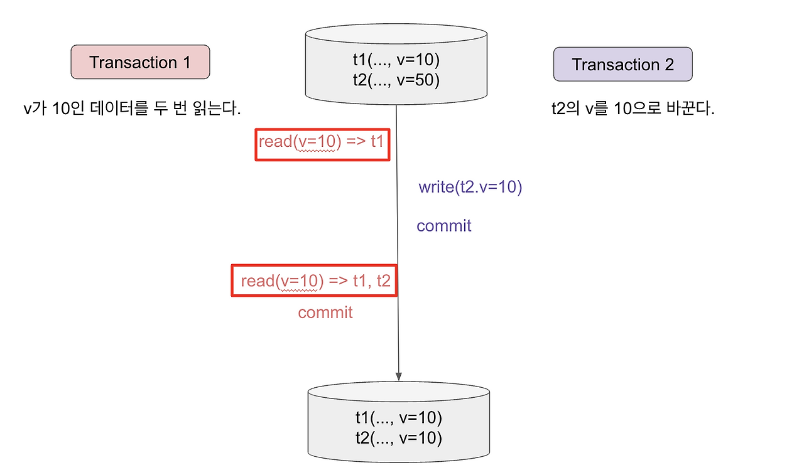
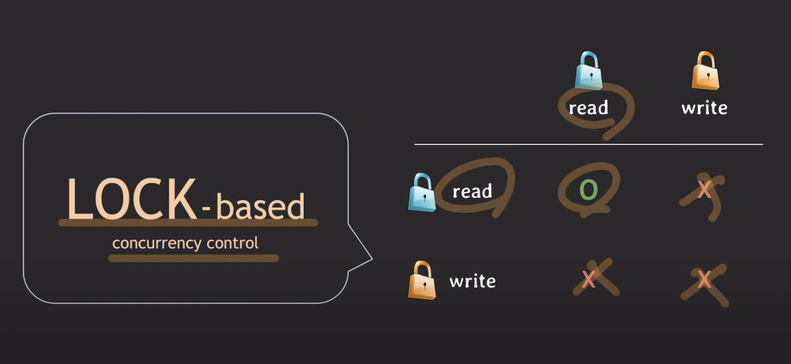

## @Transactional - isolation
 
격리 수준(isolation levels) :  동시 트랜잭션에 의해 적용된 변경 사항이 서로에게 표시되는 방식
- READ UNCOMMITED
- READ COMMITTED
- REPEATABLE READ
- SERIALIZABLE

|Isolation Level|Dirty Read|Non-Repeatable Read|Phantom Read|
|---|-|-|-|
|Read Uncommitted|O|O|O|
|Read Committed|X|O|O|
|Repeatable Read|X|X|O|
|Serializable|	X|X|X|
* Isolation Level이 밑으로 내려갈수록 안정성(데이터 일관성)은 보장이 되나, Throughput(처리량) 및 동시성 이 감소함

### 동시성 부작용
1. Dirty read : 동시 트랜잭션의 **커밋되지 않은 변경 내용을 읽는 현상**
   

2. Non-Repeatable read : **같은 데이터**를 **한 Transaction** 에서 읽었음에도 불구하고 **값이 달라지는 현상**
   

3. Phantom read : 한 개의 Transaction 에서 **같은 조건으로 2번 읽었는데 2 번의 결과가 다른 현상**. (없던 데이터가 생기는 현상)
   

### READ UNCOMMITED
* 다른 동시 트랜잭션의 커밋되지 않은 데이터를 읽음.
* 가장 낮은 격리 수준
* Dirty read, Non-Repeatable read, Phantom read 발생

### READ COMMITTED (Postgres의 기본)
* 다른 동시 트랜잭션의 커밋된 데이터를 읽음.
* Non-Repeatable read, Phantom read 발생

### REPEATABLE READ (Mysql의 기본)
* 다른 동시 트랜잭션에서 row값이 변경되더라도 한 트랜잭션 안에서는 재조회 시 다른 결과를 받지 않음.
  * 동일 트랜잭션 내 같은 row를 읽으면 항상 같은 값이 보장됨
* Phantom read 발생
  * range-queries를 다시 실행할 때 새로 추가되거나 제거된 행을 얻을 수 있다.
* Lost Update(업데이트 손실) 방지를 위한 최소 요구 수준
  * JPA환경에서는 명시적 Lock을 설정해야 함. (```@Lock(LockModeType.PESSIMISTIC_WRITE)``` etc..)
> Lost Update(업데이트 손실) : 두 개의 트랜잭션이 동시에 같은 데이터를 읽고 각각 수정한 후 저장하지만, 나중에 커밋된 값이 먼저 커밋된 값을 덮어써버리는 현상

### SERIALIZABLE
* 동시 호출을 순차적으로 실행함
* 가장 높은 격리 수준
* 동시성 부작용 발생 x

---

## MVCC 기법
* MVCC(Multi-Version Concurrency Control) : 동시 접근을 허용하는 데이터베이스에서 동시성을 제어하기 위해 사용하는 방법
* 등장 배경 : Lock 기반 동시성 제어 방식은 동일한 데이터에 대해 읽기와 쓰기가 동시에 수행되면 한 작업이 실행되는 동안 다른 작업이 블록되어 전체 처리량이 저하되고 성능 문제가 발생함. <- 이러한 문제를 해결하기 위해 MVCC 기법이 등장
    
    
* 특징
    * MVCC는 데이터를 읽을 때 특정 시점 기준으로 가장 최근에 커밋된 데이터만 읽는다. (consistent read)
    * 데이터 변화(write) 이력을 관리하기 때문에 MVCC는 추가적인 저장공간을 많이 사용한다.
    * read와 write는 서로 block하지 않기 때문에 Lock기반 동시성 제어에 비해 더 뛰어난 성능을 낼 수 있다
* MVCC 모델의 흐름
    1. 데이터에 접근하는 사용자는 해당 시점에 데이터베이스의 snapshot을 읽는다.
    2. snapshot 데이터에 대한 변경이 완료될 때 (또는 트랜잭션이 완료될 때)까지 만들어진 변경사항은 다른 데이터베이스의 사용자가 볼 수 없다.
    3. 사용자가 데이터를 업데이트 시, 이전의 데이터를 덮어 씌우는 것이 아니라 **새로운 버전의 데이터를 이전 버전의 데이터와 비교해서 변경된 내용을 UNDO에 생성**한다.
    4. 이러한 방식으로 하나의 데이터에 대해 여러 버전의 데이터가 존재하게 되고 사용자는 마지막 버전의 데이터를 읽게됨.

### Lost Update 문제
* Lost Update 문제 : 두 개의 트랜잭션이 동시에 같은 데이터를 읽고 각각 수정한 후 저장하지만, 나중에 커밋된 값이 먼저 커밋된 값을 덮어써버리는 현상

#### PostgreSQL에서 lost update 문제 해결
* 모든 연관 트랜잭션이 같은 isolation level(Repeatable Read 이상)을 가지도록 조정함으로써 문제를 해결 
* Repeatable Read 레벨에서 트랜잭션 B가 x에 대한 Write 작업을 시도하면, 이미 해당 데이터를 수정한 다른 트랜잭션이 커밋되었기 때문에 트랜잭션 B는 롤백된다. 
  * 이는 "first-updater-win" 규칙에 따른 것

#### Mysql에서 lost update 문제 해결
* Mysql에서의 문제 : 트랜잭션 A와 B가 모두 Repeatable Read isolation level을 가지고 있을 때, 여전히 lost update 문제가 발생
* 해결 방법 : Repeatable Read isolation level + Locking Read를 사용하여 문제를 해결
> **Locking Read**
> * SELECT ... FOR UPDATE: Exclusive Lock을 사용합니다. 특정 데이터에 대한 쓰기 작업을 수행하기 위해 Lock을 획득하는 방법입니다. 이로써 다른 트랜잭션들은 해당 데이터에 대한 수정 작업을 대기하게 됩니다.
> * SELECT ... FOR SHARE: Shared Lock을 사용합니다. 데이터를 읽어올 때 Lock을 획득하며, 이는 다른 트랜잭션들도 동일한 데이터에 대한 Lock을 획득할 수 있음을 의미합니다. 다른 트랜잭션들도 읽기 작업은 가능하지만 쓰기 작업은 대기해야 합니다.

---

## 트랜잭션 VS LOCK
* 트랜잭션은 근본적으로 동시성을 제어하기 위한 것이 아니라 작업의 완전성을 보장하기 위한 것
   * 트랜잭션 격리수준은 하나의 트랜잭션 내에서 또는 여러 트랜잭션 간의 작업 내용을 어떻게 공유하고 차단할 것인지를 결정하는 레벨
   * Serializable 에 해당하는 격리수준은 조회한 레코드에 대해 공유 잠금을 걸음으로써, 다른 트랜잭션에서 해당 데이터를 수정하지 못하도록 한다.
* 잠금(Lock)은 동시성을 제어하기 위해서 필요한 것


##### 참조
* 동시성 부작용 설명 및 이미지, Snapshot Isolation : https://amazelimi.tistory.com/entry/DB-Dirty-Read-Non-Repeatable-Read-Phantom-Read-%EC%98%88%EC%8B%9C-%EB%B0%8F-Snapshot-Isolation-Level-LIM#google_vignette
* isolation 이론 및 설명 : https://colevelup.tistory.com/34
* MVCC : https://velog.io/@onejaejae/DB-MVCC
* 트랜잭션 VS LOCK : https://ikjo.tistory.com/433
